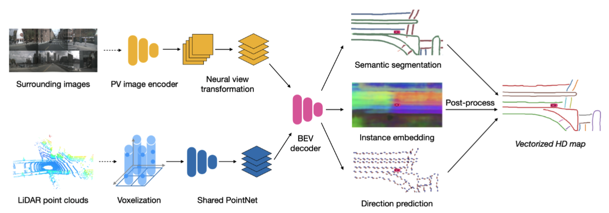
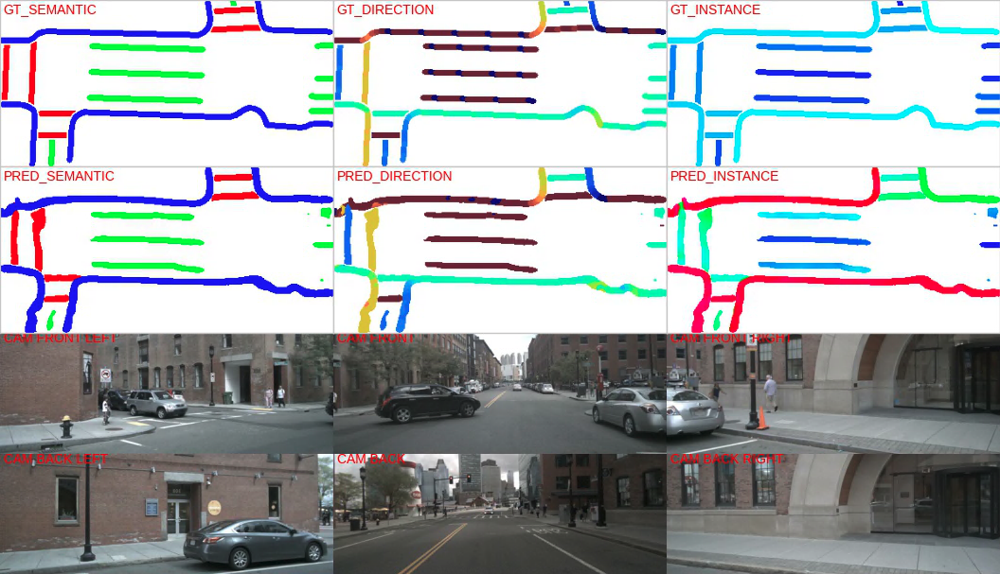
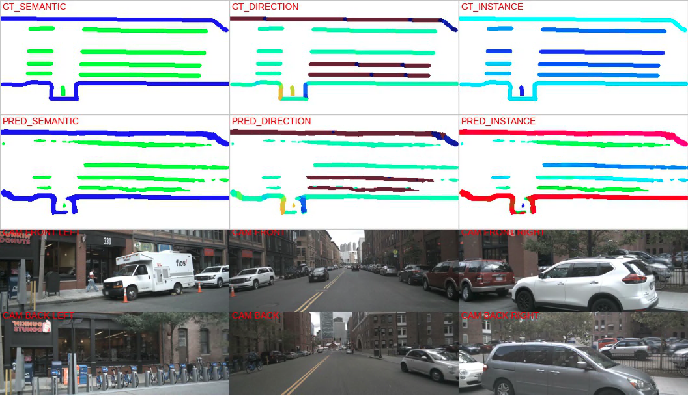

# HDMapNet

[English][[简体中文]](README_ch.md)

This is a PyTorch implementation of paper "HDMapNet: A Local Semantic Map Learning and Evaluation Framework"

**[[Paper](https://arxiv.org/abs/2107.06307)] [[Devkit Page](https://tsinghua-mars-lab.github.io/HDMapNet/)] [[5-min video](https://www.youtube.com/watch?v=AJ-rToTN8y8)]**



**Abstract**: Constructing HD semantic maps is a central component of autonomous driving. However, traditional pipelines require a vast amount of human efforts and resources in annotating and maintaining the semantics in the map, which limits its scalability. In this paper, we introduce the problem of HD semantic map learning, which dynamically constructs the local semantics based on onboard sensor observations. Meanwhile, we introduce a semantic map learning method, dubbed HDMapNet. HDMapNet encodes image features from surrounding cameras and/or point clouds from LiDAR, and predicts vectorized map elements in the bird's-eye view. We benchmark HDMapNet on nuScenes dataset and show that in all settings, it performs better than baseline methods. Of note, our camera-LiDAR fusion-based HDMapNet outperforms existing methods by more than 50% in all metrics. In addition, we develop semantic-level and instance-level metrics to evaluate the map learning performance. Finally, we showcase our method is capable of predicting a locally consistent map. By introducing the method and metrics, we invite the community to study this novel map learning problem.

## Requirements

- hfai
- torch>=1.8
- nuscenes-devkit

## Preparation

Set `data.dataroot`, `data.version`, `data.batch_size` in[config](configs/default.yaml).

## Training

Run `python train.py`

## Evaluation

Run `python eval.py` 

## Demo

Download pretrained model [HDMapNet_fusion](TODO), and set  `runtime.resume` as the path of the pretrained model in [config](configs/default.yaml). 

Then run `python demo.py`

## Samples




## References

- [lift-splat-shoot](https://github.com/nv-tlabs/lift-splat-shoot)
- [HDMapNet](https://tsinghua-mars-lab.github.io/HDMapNet)


## Citation

```
@misc{li2021hdmapnet,
    title={HDMapNet: An Online HD Map Construction and Evaluation Framework},
    author={Qi Li and Yue Wang and Yilun Wang and Hang Zhao},
    year={2021},
    eprint={2107.06307},
    archivePrefix={arXiv},
    primaryClass={cs.CV}
}
```

